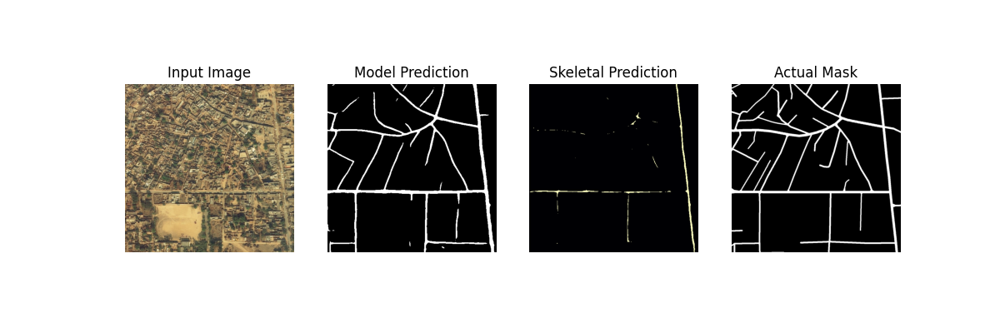

# DeepGlobe Challenge 2018 - Road Extraction

Training and evaluation of efficientnet-b5 u-net model pre-trained on ImageNet dataset with custom loss function "Center Loss". Center loss combines DiceLoss and MSE in which MSE plays role of soft-thresholder.

## Evaluation

| Model | Loss | Train Mode |  IOU |
|---|---|---|---|
| efficientnet-b5 (u-net) | - | baseline | 0.0433 |
| efficientnet-b5 (u-net) | DiceLoss | 6126, 8:2 split, testing last 100 images | 0.5651 |
| efficientnet-b5 (u-net) | CenterLoss | 6126, 8:2 split, testing last 100 images | 0.7978 |

<p align="center">
  
</p>

## Set-up:
Install requirements:
```pip install -r requirements.txt```

Download dataset:
```python download_dataset.py```

## Config:
Adjust dataset path in config file based on where you downloaded it.

## Run:
1. Run code in:
-  ```run_clean.ipynb```

2. Run code in terminal
- Training: ```python train.py --config congif.yaml```
- Evaluation: ```python evaluate.py --config congif.yaml```

## Results:
The trained model is in ```checkpoints``` and loss and iou metrics are in ```images```.

### Notes:

Dataset did not contain labels for testing split. I used last 100 images from train split as testing to evaluate IOU. 
